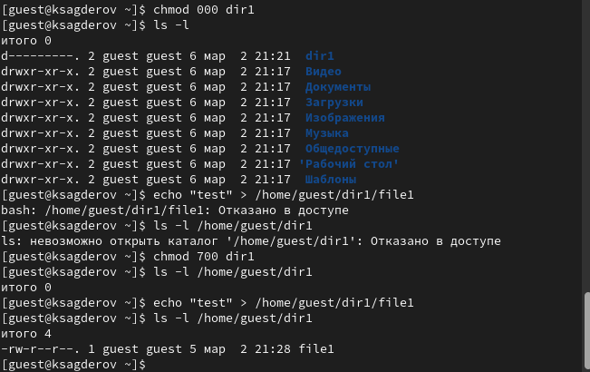

---
## Front matter
lang: ru-RU
title: Лабораторная работа №2
subtitle: "Дискреционное разграничение прав в Linux. Основные атрибуты"
author:
  - Сагдеров Камал
institute:
  - Российский университет дружбы народов, Москва, Россия
date: 02.03.2024

## i18n babel
babel-lang: russian
babel-otherlangs: english

## Formatting pdf
toc: false
toc-title: Содержание
slide_level: 2
aspectratio: 169
section-titles: true
theme: metropolis
header-includes:
 - \metroset{progressbar=frametitle,sectionpage=progressbar,numbering=fraction}
 - '\makeatletter'
 - '\beamer@ignorenonframefalse'
 - '\makeatother'
---

# Цель работы

Получение практических навыков работы в консоли с атрибутами файлов, закрепление теоретических основ дискреционного разграничения доступа в современных системах с открытым кодом на базе ОС Linux

# Выполнение лабораторной работы

Захожу в учетную запись, созданную на предыдущей ЛР. Через терминал, используя команду useradd guest создаю нового пользователя с именем guest.
Задаю пароль с помощью команды passwd guest.

1. В установленной при выполнении предыдущей лабораторной работы операционной системе создайте учётную запись пользователя guest (использую учётную запись администратора): useradd guest

{#fig:001 width=70%}

# Выполнение лабораторной работы

2. Задайте пароль для пользователя guest (использую учётную запись администратора): passwd guest

{#fig:002 width=70%}

# Выполнение лабораторной работы

3. Войдите в систему от имени пользователя guest.

{#fig:003 width=70%}

# Выполнение лабораторной работы

4. Определите директорию, в которой вы находитесь, командой pwd. Сравните её с приглашением командной строки. Определите, является ли она вашей домашней директорией? Если нет, зайдите в домашнюю директорию.

{#fig:004 width=70%}

# Выполнение лабораторной работы

5. Уточните имя вашего пользователя командой whoami.

{#fig:005 width=70%}

# Выполнение лабораторной работы

6. Уточните имя вашего пользователя, его группу, а также группы, куда входит пользователь, командой id. Выведенные значения uid, gid и др. запомните. Сравните вывод id с выводом команды groups.

{#fig:006 width=70%}

# Выполнение лабораторной работы

7. Сравните полученную информацию об имени пользователя с данными, выводимыми в приглашении командной строки.

{#fig:007 width=70%}

# Выполнение лабораторной работы

8. Просмотрите файл /etc/passwd командой cat /etc/passwd

{#fig:008 width=70%}

# Выполнение лабораторной работы

9. Определите существующие в системе директории командойls -l /home/

{#fig:009 width=70%}

# Выполнение лабораторной работы

10. Проверьте, какие расширенные атрибуты установлены на поддиректориях, находящихся в директории /home, командой:
lsattr /home

{#fig:010 width=70%}

# Выполнение лабораторной работы

11. Создайте в домашней директории поддиректорию dir1 командой
mkdir dir1

{#fig:011 width=70%}

# Выполнение лабораторной работы

12. Снимите с директории dir1 все атрибуты командойchmod 000 dir1

{#fig:012 width=70%}

# Выполнение лабораторной работы

13. Попытайтесь создать в директории dir1 файл file1 командой
echo "test" > /home/guest/dir1/file1

{#fig:013 width=70%}

# Выполнение лабораторной работы

# Выводы

Я научился использовать дискреционное разграничение прав в Linux.

:::

