---
## Front matter
title: "Лабораторная работа №2"
subtitle: "Дискреционное разграничение прав в Linux. Основные атрибуты"
author: "Сагдеров Камал"

## Generic otions
lang: ru-RU
toc-title: "Содержание"

## Bibliography
bibliography: bib/cite.bib
csl: pandoc/csl/gost-r-7-0-5-2008-numeric.csl

## Pdf output format
toc: true # Table of contents
toc-depth: 2
lof: true # List of figures
lot: true # List of tables
fontsize: 12pt
linestretch: 1.5
papersize: a4
documentclass: scrreprt
## I18n polyglossia
polyglossia-lang:
  name: russian
  options:
	- spelling=modern
	- babelshorthands=true
polyglossia-otherlangs:
  name: english
## I18n babel
babel-lang: russian
babel-otherlangs: english
## Fonts
mainfont: PT Serif
romanfont: PT Serif
sansfont: PT Sans
monofont: PT Mono
mainfontoptions: Ligatures=TeX
romanfontoptions: Ligatures=TeX
sansfontoptions: Ligatures=TeX,Scale=MatchLowercase
monofontoptions: Scale=MatchLowercase,Scale=0.9
## Biblatex
biblatex: true
biblio-style: "gost-numeric"
biblatexoptions:
  - parentracker=true
  - backend=biber
  - hyperref=auto
  - language=auto
  - autolang=other*
  - citestyle=gost-numeric
## Pandoc-crossref LaTeX customization
figureTitle: "Рис."
tableTitle: "Таблица"
listingTitle: "Листинг"
lofTitle: "Список иллюстраций"
lotTitle: "Список таблиц"
lolTitle: "Листинги"
## Misc options
indent: true
header-includes:
  - \usepackage{indentfirst}
  - \usepackage{float} # keep figures where there are in the text
  - \floatplacement{figure}{H} # keep figures where there are in the text
---

# Цель работы

Получение практических навыков работы в консоли с атрибутами файлов, закрепление теоретических основ дискреционного разграничения доступа в современных системах с открытым кодом на базе ОС Linux

# Выполнение лабораторной работы

Захожу в учетную запись, созданную на предыдущей ЛР. Через терминал, используя команду useradd guest создаю нового пользователя с именем guest.
Задаю пароль с помощью команды passwd guest.

1. В установленной при выполнении предыдущей лабораторной работы операционной системе создайте учётную запись пользователя guest (использую учётную запись администратора): useradd guest

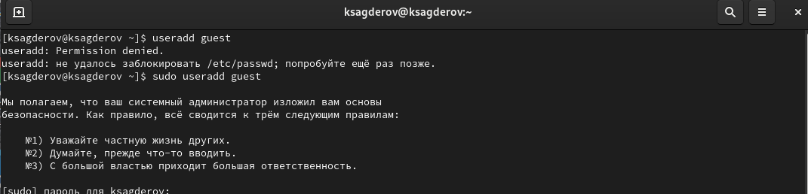{#fig:001 width=70%}

2. Задайте пароль для пользователя guest (использую учётную запись администратора): passwd guest

{#fig:002 width=70%}

3. Войдите в систему от имени пользователя guest.

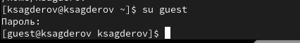{#fig:003 width=70%}

4. Определите директорию, в которой вы находитесь, командой pwd. Сравните её с приглашением командной строки. Определите, является ли она вашей домашней директорией? Если нет, зайдите в домашнюю директорию.

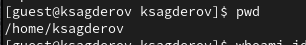{#fig:004 width=70%}

5. Уточните имя вашего пользователя командой whoami.

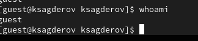{#fig:005 width=70%}

6. Уточните имя вашего пользователя, его группу, а также группы, куда входит пользователь, командой id. Выведенные значения uid, gid и др. запомните. Сравните вывод id с выводом команды groups.

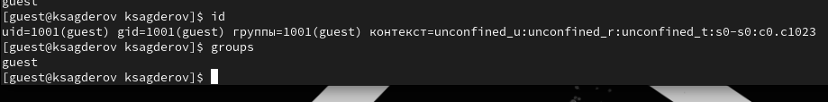{#fig:006 width=70%}

7. Сравните полученную информацию об имени пользователя с данными, выводимыми в приглашении командной строки.

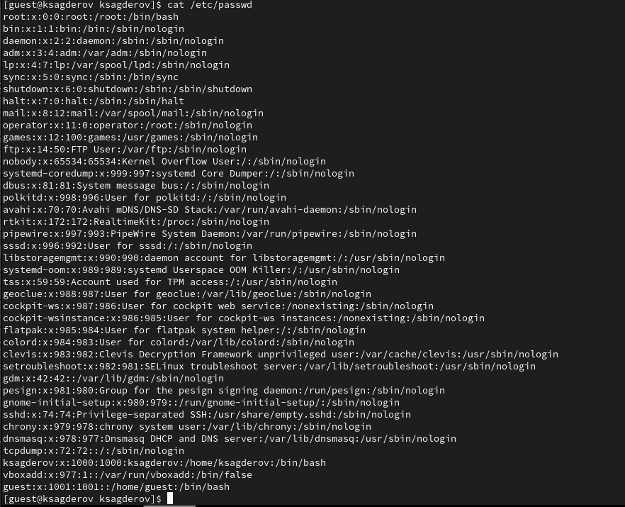{#fig:007 width=70%}

8. Просмотрите файл /etc/passwd командой cat /etc/passwd

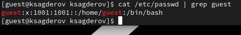{#fig:008 width=70%}

9. Определите существующие в системе директории командойls -l /home/

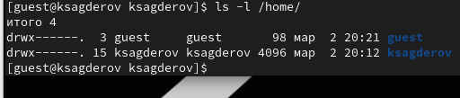{#fig:009 width=70%}

10. Проверьте, какие расширенные атрибуты установлены на поддиректориях, находящихся в директории /home, командой:
lsattr /home

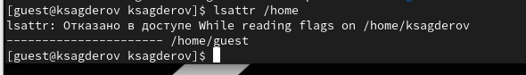{#fig:010 width=70%}

11. Создайте в домашней директории поддиректорию dir1 командой
mkdir dir1

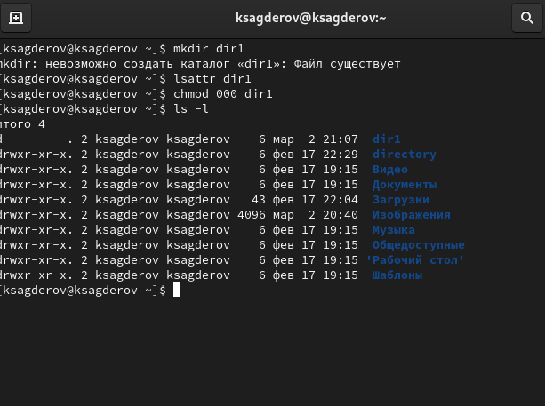{#fig:011 width=70%}

12. Снимите с директории dir1 все атрибуты командойchmod 000 dir1

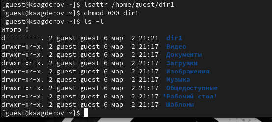{#fig:012 width=70%}

13. Попытайтесь создать в директории dir1 файл file1 командой
echo "test" > /home/guest/dir1/file1

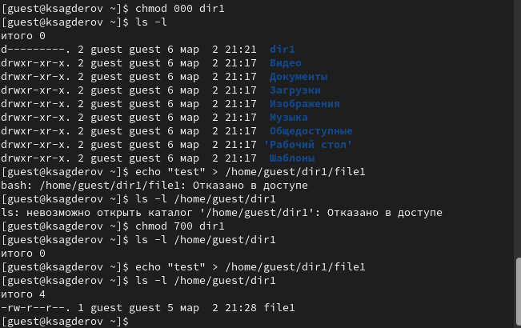{#fig:013 width=70%}

# Выводы

Я научился использовать дискреционное разграничение прав в Linux.

::: {#refs}
:::
