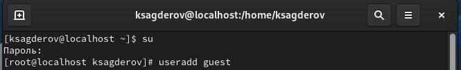
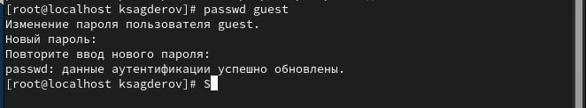
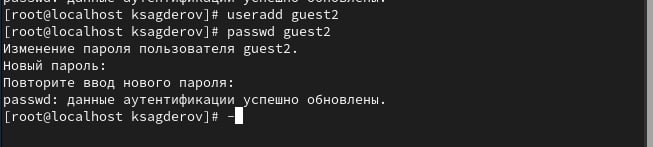
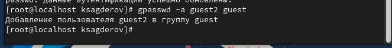
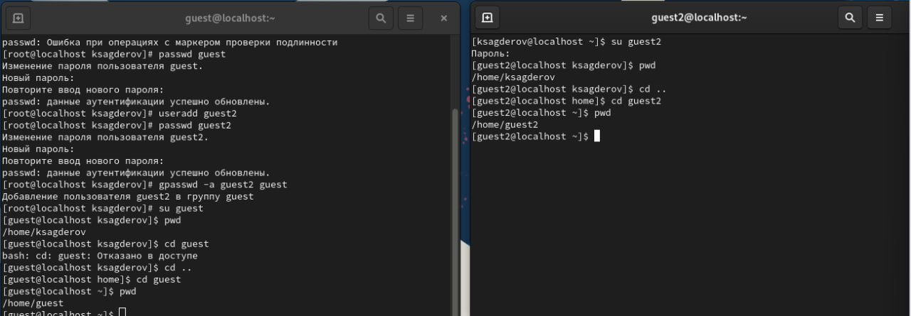
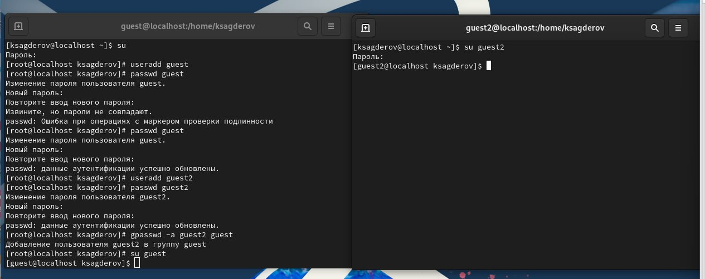
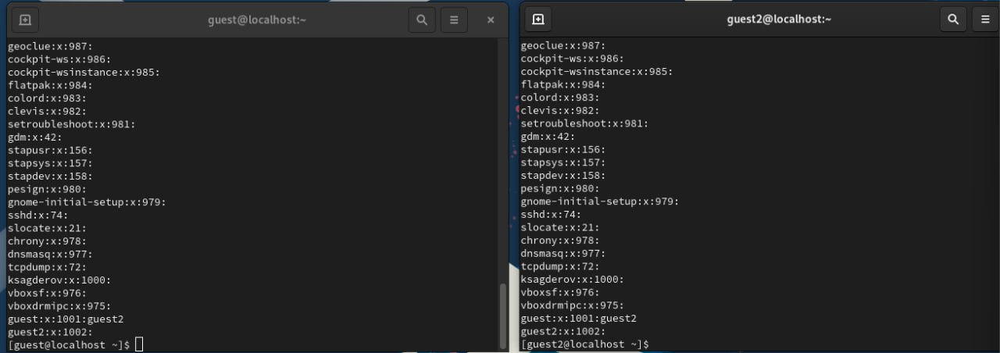
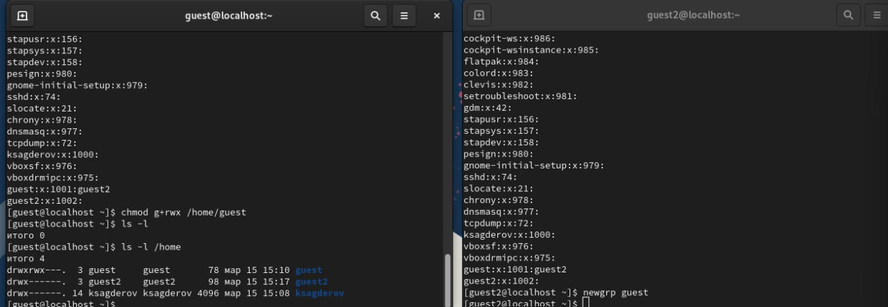
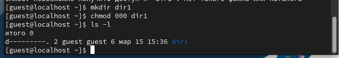
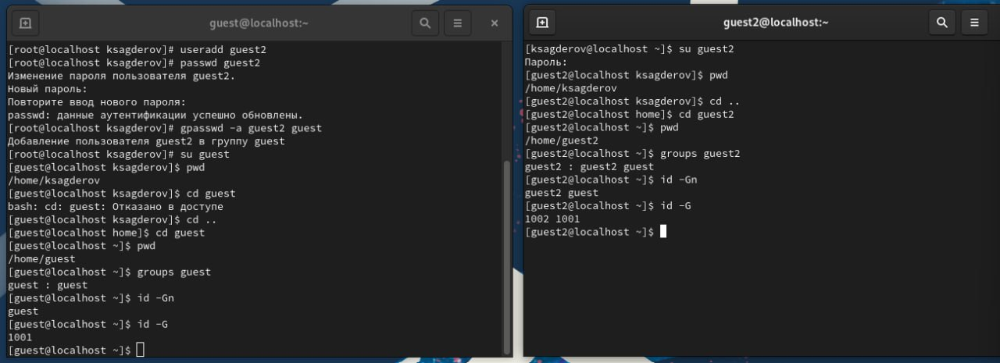

---
## Front matter
lang: ru-RU
title: Лабораторная работа №3
subtitle: "Дискреционное разграничение прав в Linux. Два пользователя"
author:
  - Сагдеров Камал
institute:
  - Российский университет дружбы народов, Москва, Россия
date: 15.03.2024

## i18n babel
babel-lang: russian
babel-otherlangs: english

## Formatting pdf
toc: false
toc-title: Содержание
slide_level: 2
aspectratio: 169
section-titles: true
theme: metropolis
header-includes:
 - \metroset{progressbar=frametitle,sectionpage=progressbar,numbering=fraction}
 - '\makeatletter'
 - '\beamer@ignorenonframefalse'
 - '\makeatother'
---

# Цель работы

Получение практических навыков работы в консоли с атрибутами файлов для групп пользователей1

# Выполнение лабораторной работы

Захожу в учетную запись, созданную на предыдущей ЛР. Через терминал, используя команду useradd guest создаю нового пользователя с именем guest.
Задаю пароль с помощью команды passwd guest.

1. В установленной операционной системе создайте учётную запись пользователя guest (использую учётную запись администратора):
useradd guest

{#fig:001 width=70%}

# Выполнение лабораторной работы

2. Задайте пароль для пользователя guest (использую учётную запись администратора):
passwd guest

{#fig:003 width=70%}

# Выполнение лабораторной работы

3. Аналогично создайте второго пользователя guest2.

{#fig:002 width=70%}

# Выполнение лабораторной работы

4. Добавьте пользователя guest2 в группу guest: gpasswd -a guest2 guest

{#fig:004 width=70%}

# Выполнение лабораторной работы

5. Осуществите вход в систему от двух пользователей на двух разных консолях: guest на первой консоли и guest2 на второй консоли.

{#fig:005 width=70%}

# Выполнение лабораторной работы

6. Для обоих пользователей командой pwd определите директорию, в которой вы находитесь. Сравните её с приглашениями командной строки.

{#fig:006 width=70%}

# Выполнение лабораторной работы

7. Уточните имя вашего пользователя, его группу, кто входит в неё и к каким группам принадлежит он сам. Определите командами
groups guest и groups guest2, в какие группы входят пользователи guest и guest2. Сравните вывод команды groups с выводом команд
id -Gn и id -G.

{#fig:007 width=70%}

# Выполнение лабораторной работы

8. Сравните полученную информацию с содержимым файла /etc/group. Просмотрите файл командой
cat /etc/group

{#fig:008 width=70%}

# Выполнение лабораторной работы

9. От имени пользователя guest2 выполните регистрацию пользователя guest2 в группе guest командой
newgrp guest

{#fig:009 width=70%}

# Выполнение лабораторной работы

10. От имени пользователя guest измените права директории /home/guest, разрешив все действия для пользователей группы:
chmod g+rwx /home/guest

{#fig:010 width=70%}

# Выполнение лабораторной работы

11. От имени пользователя guest снимите с директории /home/guest/dir1 все атрибуты командой
chmod 000 dirl

{#fig:011 width=70%}

# Выводы

Я научился использовать дискреционное разграничение прав в Linux  используя двух пользователей

:::

