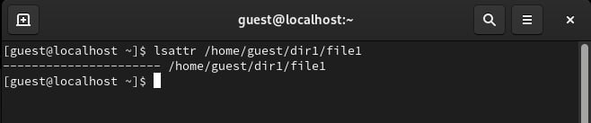
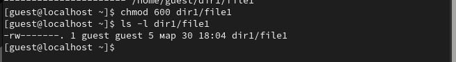
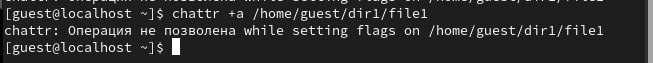
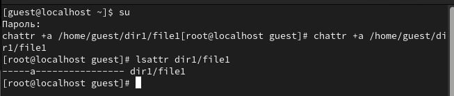
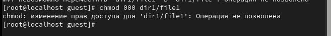
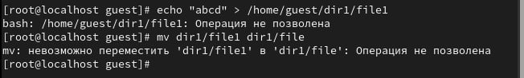
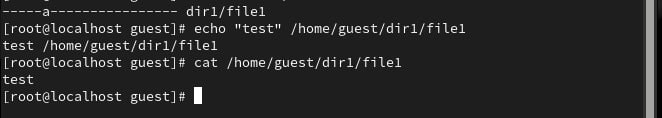
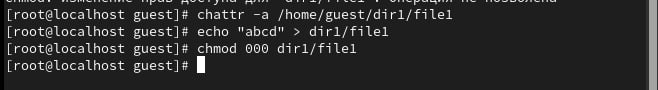

---
## Front matter
title: "Лабораторная работа №4"
subtitle: "Дискреционное разграничение прав в Linux. Расширенные атрибуты"
author: "Сагдеров Камал"

## Generic otions
lang: ru-RU
toc-title: "Содержание"

## Bibliography
bibliography: bib/cite.bib
csl: pandoc/csl/gost-r-7-0-5-2008-numeric.csl

## Pdf output format
toc: true # Table of contents
toc-depth: 2
lof: true # List of figures
lot: true # List of tables
fontsize: 12pt
linestretch: 1.5
papersize: a4
documentclass: scrreprt
## I18n polyglossia
polyglossia-lang:
  name: russian
  options:
	- spelling=modern
	- babelshorthands=true
polyglossia-otherlangs:
  name: english
## I18n babel
babel-lang: russian
babel-otherlangs: english
## Fonts
mainfont: PT Serif
romanfont: PT Serif
sansfont: PT Sans
monofont: PT Mono
mainfontoptions: Ligatures=TeX
romanfontoptions: Ligatures=TeX
sansfontoptions: Ligatures=TeX,Scale=MatchLowercase
monofontoptions: Scale=MatchLowercase,Scale=0.9
## Biblatex
biblatex: true
biblio-style: "gost-numeric"
biblatexoptions:
  - parentracker=true
  - backend=biber
  - hyperref=auto
  - language=auto
  - autolang=other*
  - citestyle=gost-numeric
## Pandoc-crossref LaTeX customization
figureTitle: "Рис."
tableTitle: "Таблица"
listingTitle: "Листинг"
lofTitle: "Список иллюстраций"
lotTitle: "Список таблиц"
lolTitle: "Листинги"
## Misc options
indent: true
header-includes:
  - \usepackage{indentfirst}
  - \usepackage{float} # keep figures where there are in the text
  - \floatplacement{figure}{H} # keep figures where there are in the text
---

# Цель работы
Получение практических навыков работы в консоли с расширенными атрибутами файлов

# Выполнение лабораторной работы

1.  От имени пользователя `guest` определим расширенные атрибуты файла `/home/guest/dir1/file1`

{#fig:001 width=70%}

2. Установите командой
chmod 600 file1 на файл file1 права, разрешающие чтение и запись для владельца файла 

{#fig:001 width=70%}

3. Попробуйте установить на файл /home/guest/dir1/file1 расширенный атрибут a от имени пользователя guest: 

{#fig:001 width=70%} 

4. Попробуйте установить расширенный атрибут a на файл /home/guest/dir1/file1 от имени суперпользователя:
chattr +a /home/guest/dir1/file1

5. От пользователя guest проверьте правильность установления атрибута:
lsattr /home/guest/dir1/file1 

{#fig:001 width=70%} 

6. Выполните дозапись в файл file1 слова «test» командой 

{#fig:001 width=70%} 

7. Попробуйте удалить файл file1 либо стереть имеющуюся в нём информацию командой
Попробуйте переименовать файл.

 {#fig:001 width=70%} 

8. Попробуйте с помощью команды chmod 000 file1 установить на файл file1 права, например, запрещающие чтение и запиись для владельца файла 

{#fig:001 width=70%} 

9. Снимите расширенный атрибут a с файла /home/guest/dirl/file1 от имени суперпользователя командой
Повторите операции, которые вам ранее не удавалось выполнить. Ваши наблюдения занесите в отчёт.

{#fig:001 width=70%} 

10. Повторите ваши действия по шагам, заменив атрибут «a» атрибутом «i» 

{#fig:001 width=70%} 

# Выводы

В результате выполнения работы я повысил свои навыки использования интерфейса командой строки (CLI), познакомился на примерах с тем, как используются основные и расширенные атрибуты при разграничении доступа. Имел возможность связать теорию дискреционного разделения доступа (дискреционная политика безопасности) с её реализацией на практике в ОС Linux. Составил наглядные таблицы, поясняющие какие операции возможны при тех или иных установленных правах. Опробовал действие на практике расширенных атрибутов «а» и «i».

::: {#refs}
:::
