---
## Front matter
title: "Лабораторная работа №5"
subtitle: "Дискреционное разграничение прав в Linux. Исследование влияния дополнительных атрибутов"
author: "Сагдеров Камал"

## Generic otions
lang: ru-RU
toc-title: "Содержание"

## Bibliography
bibliography: bib/cite.bib
csl: pandoc/csl/gost-r-7-0-5-2008-numeric.csl

## Pdf output format
toc: true # Table of contents
toc-depth: 2
lof: true # List of figures
lot: true # List of tables
fontsize: 12pt
linestretch: 1.5
papersize: a4
documentclass: scrreprt
## I18n polyglossia
polyglossia-lang:
  name: russian
  options:
	- spelling=modern
	- babelshorthands=true
polyglossia-otherlangs:
  name: english
## I18n babel
babel-lang: russian
babel-otherlangs: english
## Fonts
mainfont: PT Serif
romanfont: PT Serif
sansfont: PT Sans
monofont: PT Mono
mainfontoptions: Ligatures=TeX
romanfontoptions: Ligatures=TeX
sansfontoptions: Ligatures=TeX,Scale=MatchLowercase
monofontoptions: Scale=MatchLowercase,Scale=0.9
## Biblatex
biblatex: true
biblio-style: "gost-numeric"
biblatexoptions:
  - parentracker=true
  - backend=biber
  - hyperref=auto
  - language=auto
  - autolang=other*
  - citestyle=gost-numeric
## Pandoc-crossref LaTeX customization
figureTitle: "Рис."
tableTitle: "Таблица"
listingTitle: "Листинг"
lofTitle: "Список иллюстраций"
lotTitle: "Список таблиц"
lolTitle: "Листинги"
## Misc options
indent: true
header-includes:
  - \usepackage{indentfirst}
  - \usepackage{float} # keep figures where there are in the text
  - \floatplacement{figure}{H} # keep figures where there are in the text
---

# Цель работы

Изучение механизмов изменения идентификаторов, применения SetUID- и Sticky-битов. Получение практических навыков работы в консоли с дополнительными атрибутами. Рассмотрение работы механизма смены идентификатора процессов пользователей, а также влияние бита Sticky на запись и удаление файлов.

# Выполнение лабораторной работы

1. Войдите в систему от имени пользователя guest.
2. Создайте программу simpleid.c:

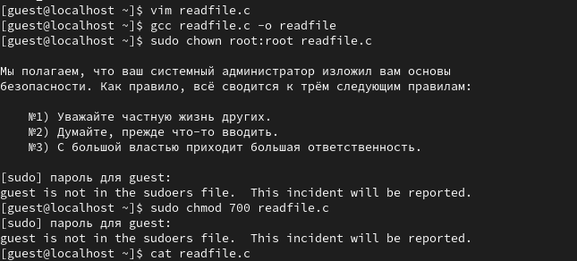{#fig:001 width=70%}

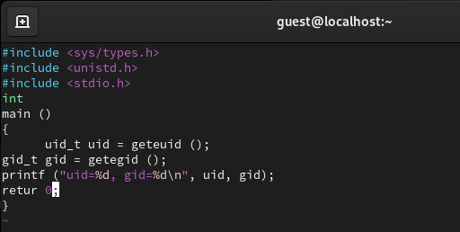{#fig:002 width=70%}

3. Скомплилируйте программу и убедитесь, что файл программы создан: gcc simpleid.c -o simpleid
4. Выполните программу simpleid:
./simpleid

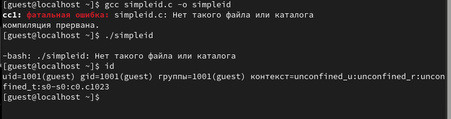{#fig:003 width=70%}

5. Выполните системную программу id: id и сравните полученный вами результат с данными предыдущего пункта задания.

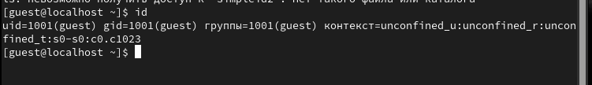{#fig:004 width=70%}

6. Усложните программу, добавив вывод действительных идентификаторов:

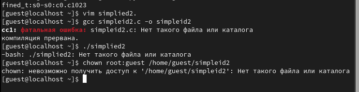{#fig:005 width=70%}

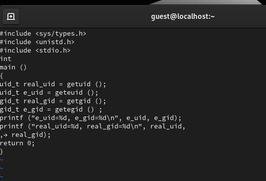{#fig:006 width=70%}

7. Скомпилируйте и запустите simpleid2.c: gcc simpleid2.c -o simpleid2 ./simpleid2

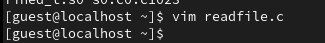{#fig:007 width=70%}

8. От имени суперпользователя выполните команды:
chown root:guest /home/guest/simpleid2
chmod u+s /home/guest/simpleid2
9. Используйте sudo или повысьте временно свои права с помощью su. Поясните, что делают эти команды.
10. Выполните проверку правильности установки новых атрибутов и смены
владельца файла simpleid2:

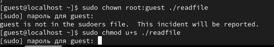{#fig:009 width=70%}

11. Запустите simpleid2 и id:
./simpleid2
id
Сравните результаты.
12. Проделайте тоже самое относительно SetGID-бита.
13. Создайте программу readfile.c:

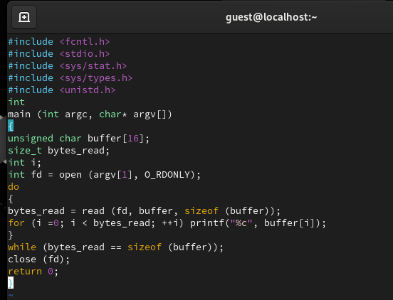{#fig:008 width=70%}

14. Откомпилируйте её.
gcc readfile.c -o readfile

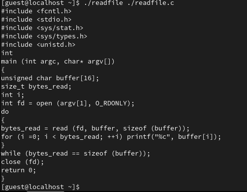{#fig:010 width=70%}

# Исследование Sticky-бита

1. Выясните, установлен ли атрибут Sticky на директории /tmp, для чего выполните команду
ls -l / | grep tmp

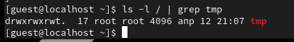{#fig:011 width=70%}

2. От имени пользователя guest создайте файл file01.txt в директории /tmp со словом test:
echo "test" > /tmp/file01.txt
3. Просмотрите атрибуты у только что созданного файла и разрешите чтение и запись для категории пользователей «все остальные»:
ls -l /tmp/file01.txt
chmod o+rw /tmp/file01.txt
ls -l /tmp/file01.txt

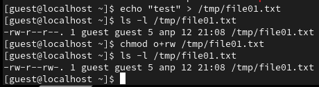{#fig:012 width=70%}

4. От пользователя guest2 (не являющегося владельцем) попробуйте прочитать файл /tmp/file01.txt:
cat /tmp/file01.txt
5. От пользователя guest2 попробуйте дозаписать в файл
/tmp/file01.txt слово test2 командой
echo "test2" > /tmp/file01.txt

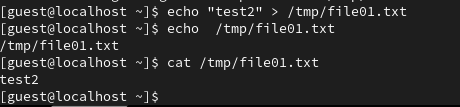{#fig:013 width=70%}

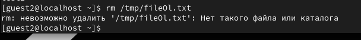{#fig:014 width=70%}

6. Проверьте содержимое файла командой
cat /tmp/file01.txt
7. От пользователя guest2 попробуйте записать в файл /tmp/file01.txt
слово test3, стерев при этом всю имеющуюся в файле информацию командой
echo "test3" > /tmp/file01.txt

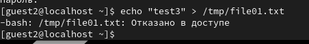{#fig:016 width=70%}

8. Проверьте содержимое файла командой
cat /tmp/file01.txt

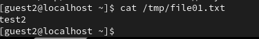{#fig:017 width=70%}

9. От пользователя guest2 попробуйте удалить файл /tmp/file01.txt командой
rm /tmp/fileOl.txt
Удалось ли вам удалить файл?
10. Повысьте свои права до суперпользователя следующей командой
su -
и выполните после этого команду, снимающую атрибут t (Sticky-бит) с
директории /tmp:
chmod -t /tmp

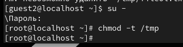{#fig:015 width=70%}

11. Покиньте режим суперпользователя командой
exit

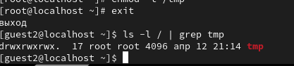{#fig:018 width=70%}

12. От пользователя guest2 проверьте, что атрибута t у директории /tmp
нет:
ls -l / | grep tmp

13. Повторите предыдущие шаги. Какие наблюдаются изменения?
14. Удалось ли вам удалить файл от имени пользователя, не являющегося
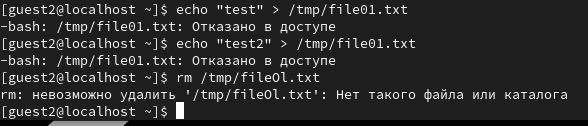{#fig:019 width=70%}

# Выводы

В результате выполнения работы я выполнил цели работы
::: {#refs}
:::
