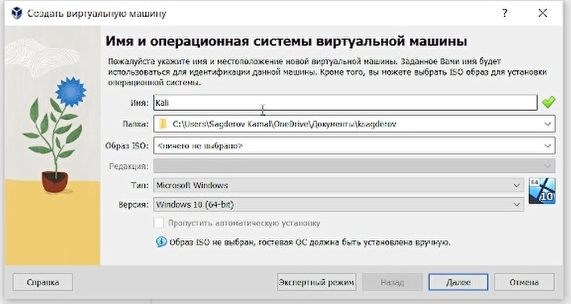

---
## Front matter
lang: ru-RU
title: Этап №1
subtitle: Установка Kali Linux
author:
  - Сагдеров Камал
institute:
  - Российский университет дружбы народов, Москва, Россия
date: 02.03.2024

## i18n babel
babel-lang: russian
babel-otherlangs: english

## Formatting pdf
toc: false
toc-title: Содержание
slide_level: 2
aspectratio: 169
section-titles: true
theme: metropolis
header-includes:
 - \metroset{progressbar=frametitle,sectionpage=progressbar,numbering=fraction}
 - '\makeatletter'
 - '\beamer@ignorenonframefalse'
 - '\makeatother'
---

# Цель работы

Целью данной работы является приобретение практических навыков
установки операционной системы на виртуальную машину, настройки минимально необходимых для дальнейшей работы сервисов.

Установить на виртуальную машину систему KaLi inux и выполнить команды для получения информации:

Скачивание образа Kali Linux

{#fig:001 width=70%}

Создвние новой виртуальной машину

# Выполнение лабораторной работы

{#fig:002 width=70%}

# Выполнение лабораторной работы

{#fig:003 width=70%}

# Выполнение лабораторной работы

{#fig:004 width=70%}

# Настройка Kali Linux

{#fig:005 width=70%}

# Настройка Kali Linux

{#fig:008 width=70%}

# Настройка Kali Linux

{#fig:009 width=70%}

# Настройка Kali Linux

{#fig:010 width=70%}

# Настройка Kali Linux

{#fig:011 width=70%}

# Настройка Kali Linux

{#fig:012 width=70%}

# Установка Kali Linux 

{#fig:013 width=70%}

# Установка Kali Linux 

{#fig:014 width=70%}

# Установка Kali Linux 

{#fig:015 width=70%}

# Установка Kali Linux 

{#fig:016 width=70%}

# Установка Kali Linux 

{#fig:017 width=70%}

# Установка Kali Linux 

{#fig:018 width=70%}

# Открытие виртуальной машины Kali Linux

{#fig:019 width=70%}

{#fig:020 width=70%}

# Выводы

Я научился устанавливать систему на виртуальную машину и настраивать сервисы, необходимые для ее работы.

::: {#refs}
:::
