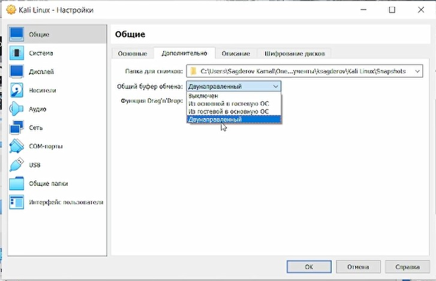
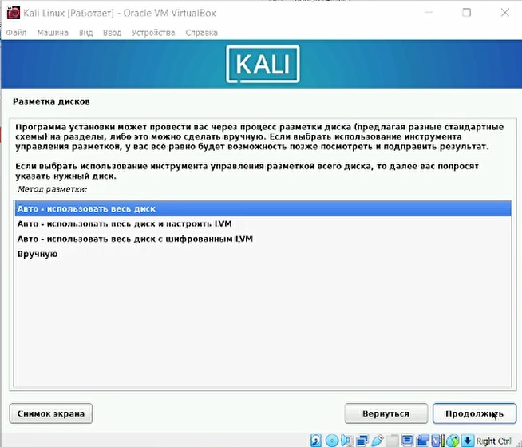
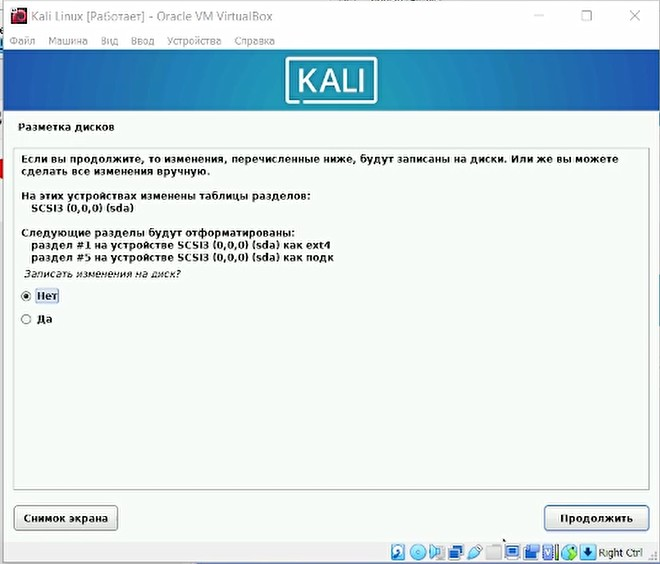

---
## Front matter
title: "Этап 1"
subtitle: "Установка Kali Linux"
author: "Сагдеров Камал"

## Generic otions
lang: ru-RU
toc-title: "Содержание"

## Bibliography
bibliography: bib/cite.bib
csl: pandoc/csl/gost-r-7-0-5-2008-numeric.csl

## Pdf output format
toc: true # Table of contents
toc-depth: 2
lof: true # List of figures
lot: true # List of tables
fontsize: 12pt
linestretch: 1.5
papersize: a4
documentclass: scrreprt
## I18n polyglossia
polyglossia-lang:
  name: russian
  options:
	- spelling=modern
	- babelshorthands=true
polyglossia-otherlangs:
  name: english
## I18n babel
babel-lang: russian
babel-otherlangs: english
## Fonts
mainfont: PT Serif
romanfont: PT Serif
sansfont: PT Sans
monofont: PT Mono
mainfontoptions: Ligatures=TeX
romanfontoptions: Ligatures=TeX
sansfontoptions: Ligatures=TeX,Scale=MatchLowercase
monofontoptions: Scale=MatchLowercase,Scale=0.9
## Biblatex
biblatex: true
biblio-style: "gost-numeric"
biblatexoptions:
  - parentracker=true
  - backend=biber
  - hyperref=auto
  - language=auto
  - autolang=other*
  - citestyle=gost-numeric
## Pandoc-crossref LaTeX customization
figureTitle: "Рис."
tableTitle: "Таблица"
listingTitle: "Листинг"
lofTitle: "Список иллюстраций"
lotTitle: "Список таблиц"
lolTitle: "Листинги"
## Misc options
indent: true
header-includes:
  - \usepackage{indentfirst}
  - \usepackage{float} # keep figures where there are in the text
  - \floatplacement{figure}{H} # keep figures where there are in the text
---

# Цель работы

Целью данной работы является приобретение практических навыков
установки операционной системы на виртуальную машину, настройки минимально необходимых для дальнейшей работы сервисов.

Установить на виртуальную машину систему KaLi inux и выполнить команды для получения информации:

# Теоретическое введение

Как установить Kali Linux на VirtualBox
В этой статье мы расскажем, что такое Kali, в каких случаях она используется и как происходит установка Kali Linux на виртуальную машину в VirtualBox.

Что такое Kali Linux
Kali Linux — это дистрибутив операционной системы Linux. Это одна из немногих систем, которая предназначена для специалистов информационной безопасности. В неё входит ряд утилит, которые созданы для тестирования уязвимостей. Kali редко используется как основная ОС, чаще всего она устанавливается как гостевая.

Система Kali Linux была разработана в 2013 году. Над ней работала команда из Offensive Security. За основу была взята структура Debian, а инструменты тестирования информационной безопасности были взяты из ОС BackTrack. Первый релиз был выпущен 13 марта 2013 года.

Как установить Kali Linux на VirtualBox
В этой статье мы расскажем, что такое Kali, в каких случаях она используется и как происходит установка Kali Linux на виртуальную машину в VirtualBox.

Что такое Kali Linux
Kali Linux — это дистрибутив операционной системы Linux. Это одна из немногих систем, которая предназначена для специалистов информационной безопасности. В неё входит ряд утилит, которые созданы для тестирования уязвимостей. Kali редко используется как основная ОС, чаще всего она устанавливается как гостевая.

Система Kali Linux была разработана в 2013 году. Над ней работала команда из Offensive Security. За основу была взята структура Debian, а инструменты тестирования информационной безопасности были взяты из ОС BackTrack. Первый релиз был выпущен 13 марта 2013 года.

Kali Linux распространяется в 32-битных и 64-битных образах для использования на хостах на основе набора команд x86 и в качестве образа для архитектуры ARM для использования на Beagle board и на Chromebook от AMD

Разработчики Kali Linux стремятся сделать Kali Linux доступным для ещё большего количества устройств с архитектурой ARM

Kali Linux уже доступен для BeagleBone Black, HP Chromebook, CubieBoard 2, CuBox, CuBox-i, Raspberry Pi, EfikaMX, Odroid U2, Odroid XU, Odroid XU3, Samsung Chromebook, Utilite Pro, Galaxy Note 10.1 и SS808

С появлением Kali NetHunter, Kali Linux также официально доступен на смартфонах, таких как Nexus 5, Nexus 6, Nexus 7, Nexus 9, Nexus 10, OnePlus One и других.
Kali Linux доступен в Windows 10, поверх Windows Subsystem for Linux (WSL). Официальный дистрибутив Kali для Windows можно загрузить из Microsoft Store

# Выполнение лабораторной работы

Скачивание образа Kali Linux

{#fig:001 width=70%}

Создвние новой виртуальной машину

{#fig:002 width=70%}

{#fig:003 width=70%}

{#fig:004 width=70%}

Настройка Kali Linux

{#fig:005 width=70%}

{#fig:008 width=70%}

{#fig:009 width=70%}

{#fig:010 width=70%}

{#fig:011 width=70%}

{#fig:012 width=70%}

Установка Kali Linux 

{#fig:013 width=70%}

{#fig:014 width=70%}

{#fig:015 width=70%}

{#fig:016 width=70%}

{#fig:017 width=70%}

{#fig:018 width=70%}

Открытие виртуальной машины Kali Linux

{#fig:019 width=70%}

{#fig:020 width=70%}

# Выводы

Я научился устанавливать систему на виртуальную машину и настраивать сервисы, необходимые для ее работы.

# Список литературы{.unnumbered}

::: {#refs}
:::
